# 实验结果总结（20191023）

彭正皓

2019年11月1日收尾

## 前言

我们到底要探究什么问题？

1. 哪种距离表示方法好
2. 哪种Representation好
3. 如何施加噪音生成各种agents？

那么，怎么才叫**距离表示方法**好呢？就是：

1. 随着噪音加大，no-fintuned距离应该稳定的扩大。（重点在稳定）
2. 计算效率要高，比如CKA的效率就不太高，扩展性差

怎么才叫Representation好呢？就是：

1. Representation的距离指标要好。
2. 散点图看起来要漂亮

第三个问题，如何施加噪音生成各种agents，我没办法告诉你“如何去做”。所以这个问题实际上是个烂问题，我也懒得、并且不懂得回答了。

## 概述

### 奖励、距离和噪音强度的关系

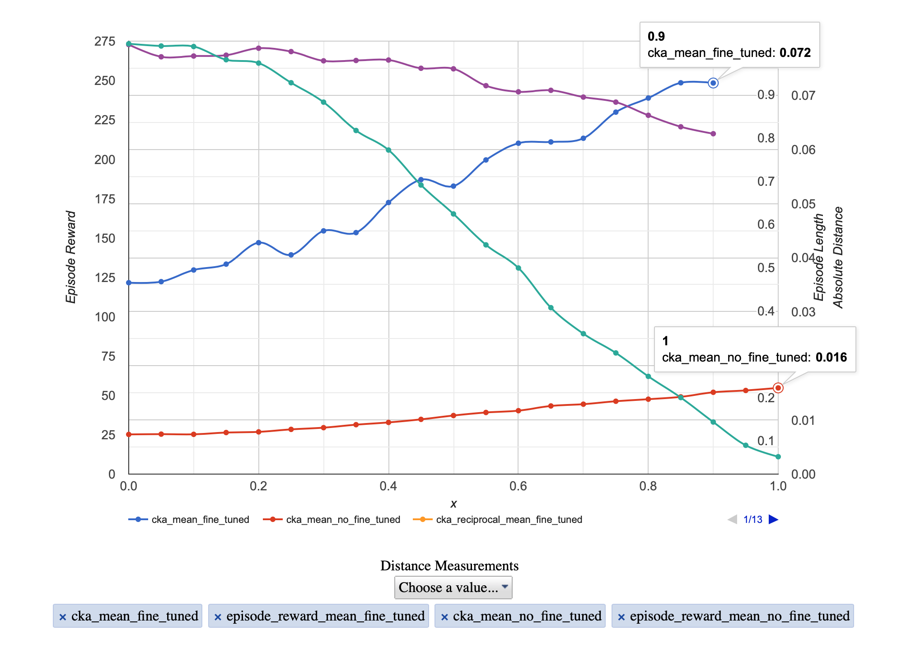

这幅图符合我们的预期：

1. 随着噪音的加大，奖励降低。
2. finetune的情况奖励下降幅度较小。（且也许可以更高，这跟finetune过程的超参数有关）
3. 随着噪音的加大，距离加大。
4. no-finetune情况下噪音加大的幅度小了很多。

这是数值上的定量分析，其实在2D可视化上看的也很清楚。结论：

1. 在Policy空间中，每个Policy本身已经是一个局部最优点了，在它的附近不存在Reward更高的Policy，或者说不存在Reward不下降而行为不一致的policy。

## 不同距离表示方法比较

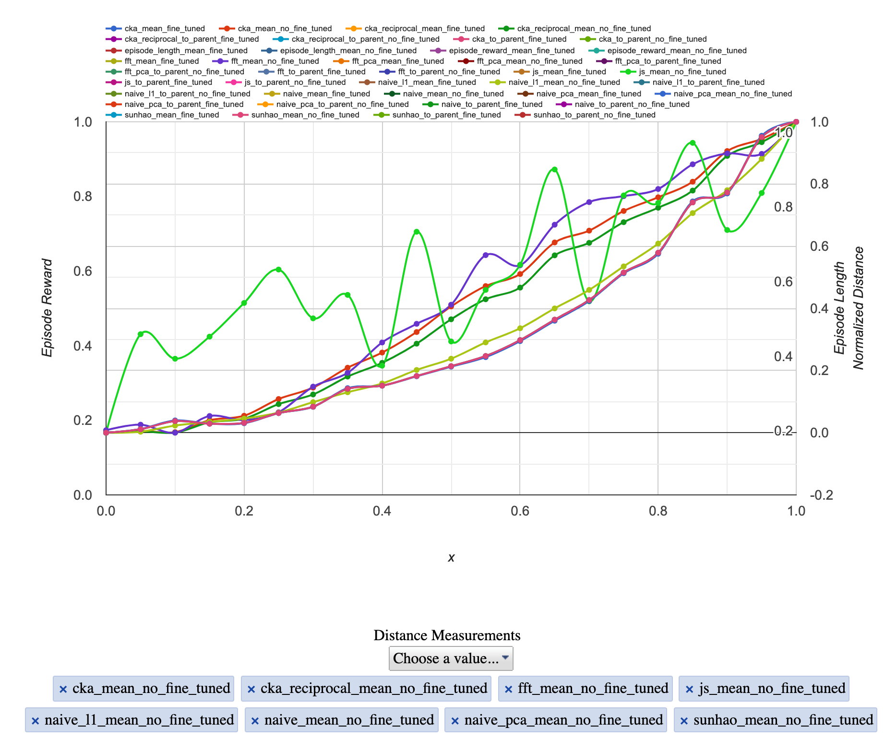

前面说到了，距离表示方法的好坏取决于non-finetune情况下的曲线平稳与否。

因此这里给出了一批归一化之后的non-finetune的结果。

* 浅绿色变化最诡异的是 JS 距离。
* 深蓝色变化比较诡异的是 FFT 表征的距离。

**Naive-L1 数值很大**

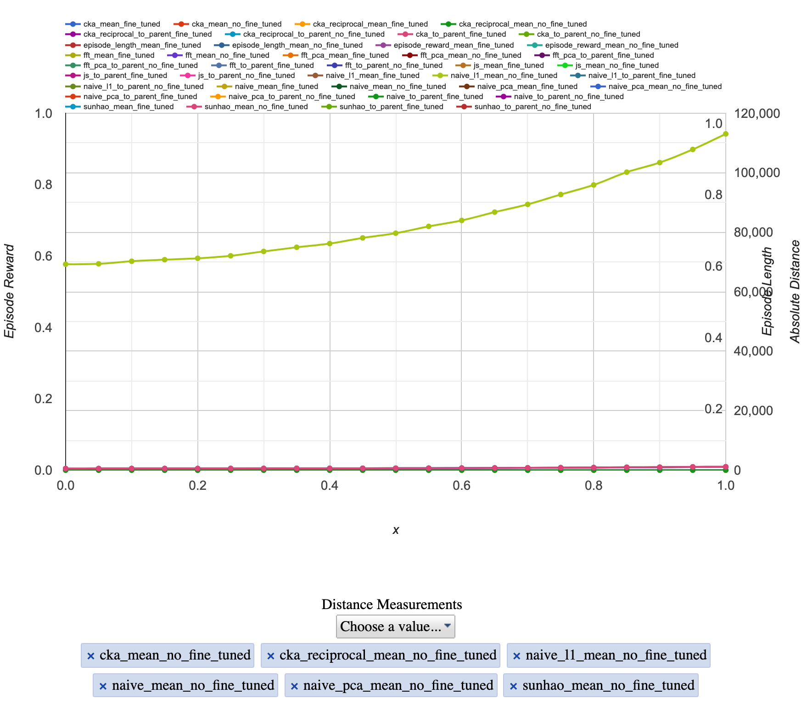

**孙浩距离/Naive/NaivePCA三种距离数值上一致**

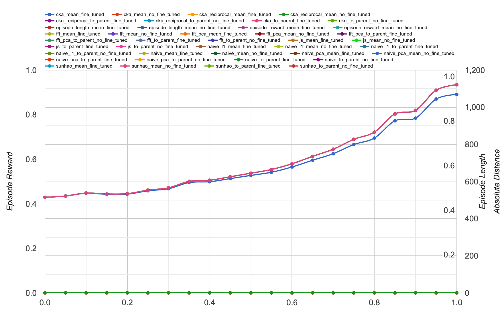

这个是对的。很合情理。

阶段性结论：

* 孙浩距离、Naive距离、NaivePCA、NaiveL1 距离是很好的。
* CKA距离的问题在于计算过于复杂，第一，它需要策略网络的激活值，第二，它的计算是 $O(a^2k^2N^2)$ 复杂度，N为agent的数目。而孙浩距离是两个replay向量直接求第二范数。时间复杂度是 $O(b^2k^2N^2)$ ，他们的差别在于少了 a 那一项。a等于激活值个数，b等于动作空间的维度数目，k等于joint dataset从每个agent的经验中采样多少个样本。

下面探索的问题是，各种距离是否能很好的看出finetune和不finetune的区别。

### 

FFT：

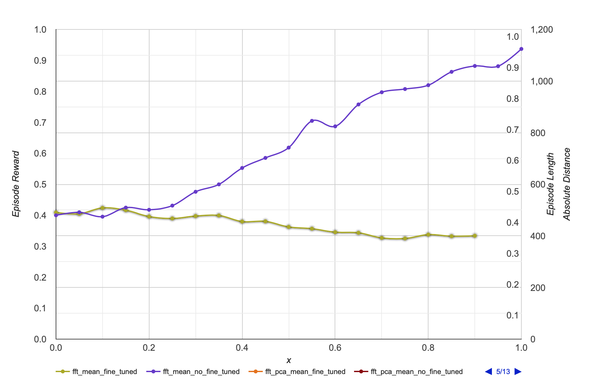

深蓝色是没有重训练。

这个图的结果就还挺符合我们的理解的。

疑惑：草绿色居然还下降了，就说明重训练帮助Policy空间更加紧凑了？（不是没有可能，就像那个回火算法，温度提升再下降可以跳出局部最优）。

PCA版本的FFT与这个的曲线一模一样。就连数值也一样。

疑惑：PCA之后的FFT表达的尺度都不一样，数值为什么会一样？这可能吗？

疑惑：为什么FFT的结果和别的距离指标的结论不一致？

Naive的结果：

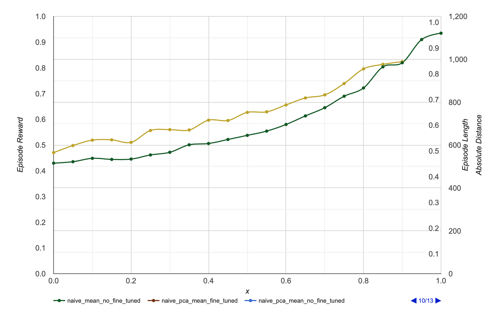

普通版本。深绿色是没有重训练。

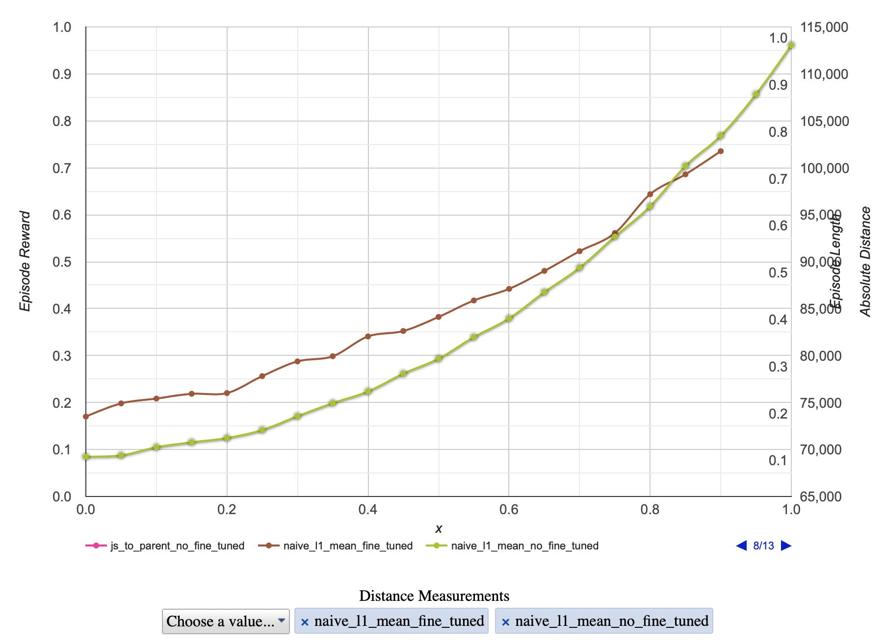

这个是Naive表征的L1距离版本。草绿色是没有重训练。

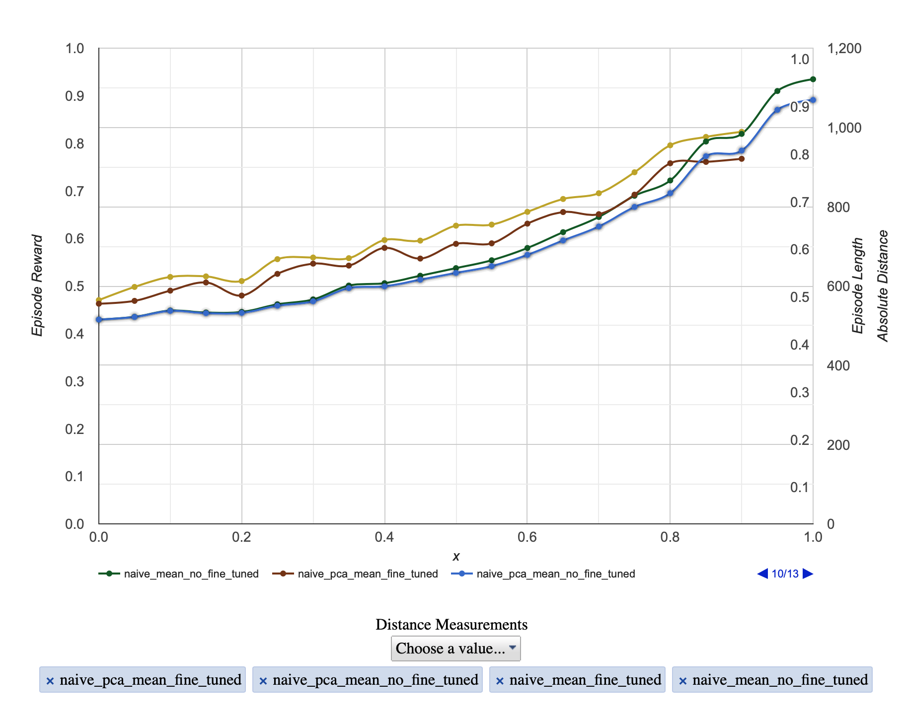

Naive的PCA版本和普通版本结果几乎一样。

孙浩距离：

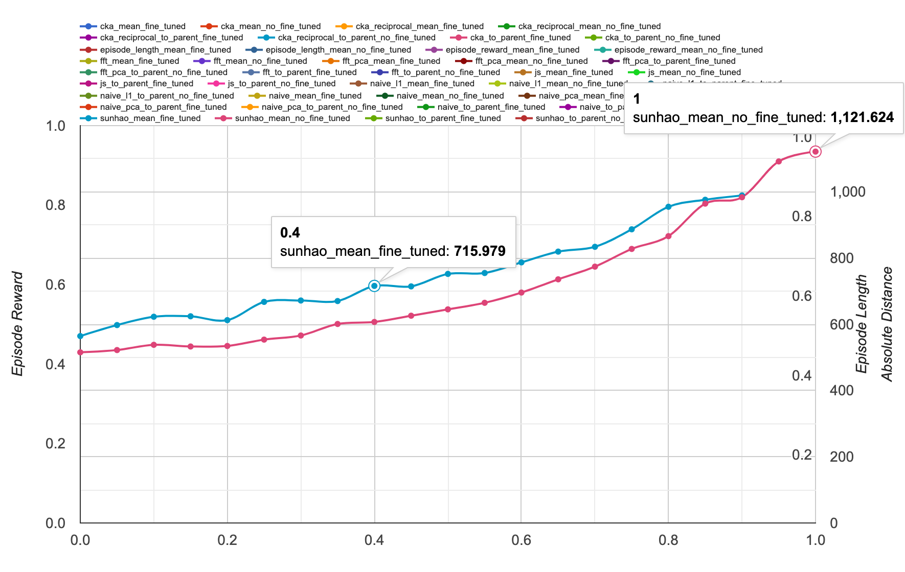

Naive表征和孙浩距离都反映了：无论训不训练，距离都在逐步增大。

疑惑：为什么初始状态的数值不想等？答案：可能是Joint dataset采样树木不够反映全貌。

疑惑：为什么Naive表征和FFT表征的结论不一样？一个是说无论训不训练距离都在不断增大，另一个却说训练之后距离变小，不训练的话距离增大？

办法：再看一看关于parent的情况。

首先看一看CKA的parent 对比：

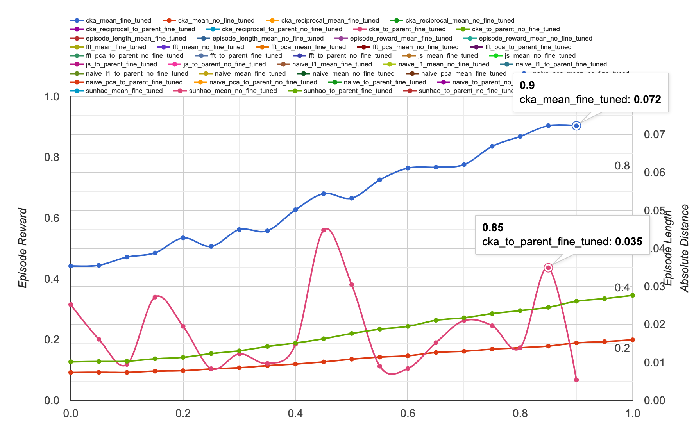

1. 在有训练的情况下，CKA距离在增大，关于Parent的距离有大幅波动。

2. 在无训练的情况下，关于Parent的距离（草绿线）平稳上升，且一直大于与全体相比的距离。
3. 有训练的CKA距离显著大于没有训练的CKA距离（朱红色线）。

看一看孙浩距离的对比：（Naive距离与孙浩距离一致）

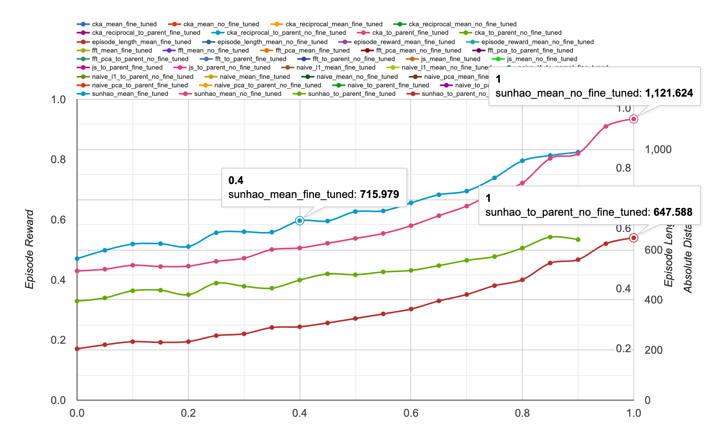

1. 在有训练的情况下，孙浩距离都在增加（草绿和天蓝线）。相比全体的距离一直大于相比parent的距离。
2. 在无训练的情况下，孙浩距离都在增加。相比全体的距离一直大于相比parent的距离（与CKA矛盾）。
3. 有训练的距离（天蓝）稍微大于无训练的距离（粉红）。

看一看FFT距离：

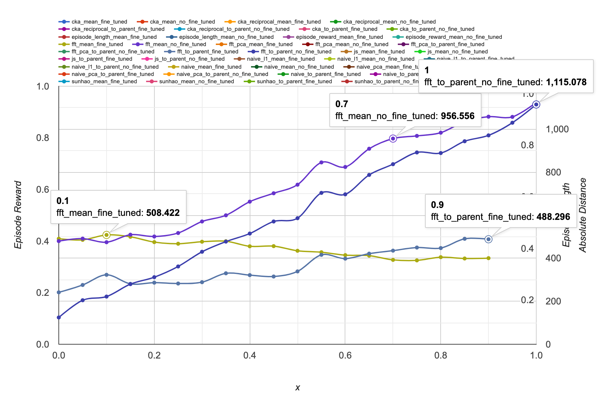

1. 在有训练的情况下，FFT距离在下降（与CKA和孙浩矛盾）。相比全体的距离**在前期**大于相比parent的距离。
2. 在无训练的情况下，FFT距离都在增加。相比全体的距离一直大于相比parent的距离（与CKA矛盾）。
3. 有训练的距离（天蓝）**一直小于**无训练的距离（粉红）（与CKA和孙浩矛盾）。

虽然JS距离傻掉了，但是还是看一眼：

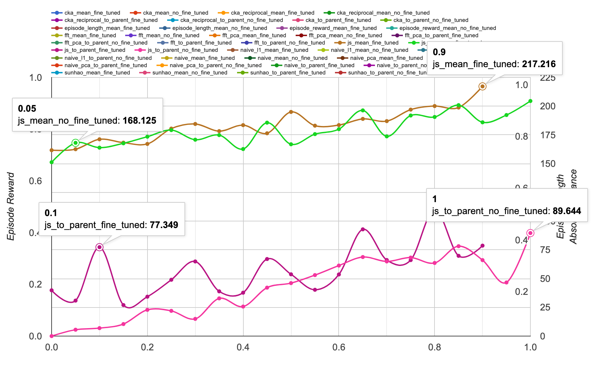

看到训不训练都差不多，乱七八糟的。但是到全体的距离大于到Parent的距离。这点应当是符合常理的。

这里重复一下什么叫到parent的距离：指的是同一个agent衍生出来的child到parent的距离的平均值。按理说，这个肯定应当小于全体agent互相之间的距离的平均值。因为毕竟是同个妈生的，应当会有点共性。

## 结论

| 常识                                                         | CKA                                               | 孙浩 | FFT              | JS                       |
| ------------------------------------------------------------ | ------------------------------------------------- | ---- | ---------------- | ------------------------ |
| Parent距离应当小于全体距离（finetune）                       | 对。但是parent距离在剧烈波动。                    | 对   | 前期对，后期不对 | 对                       |
| Parent距离应当小于全体距离（no finetune）                    | 不对，Parent距离大于全体距离。                    | 对   | 对               | 对                       |
| Finetune的距离也许会小于no finetune的距离                    | 不对，Finetune的距离大大的大于no finetune的距离。 | 对   | 对               | 不清楚                   |
| 在no finetune的情况下，曲线应该稳步上升                      | 对。但是幅度很小。                                | 对   | 对               | 波动很大                 |
| 在finetune的情况下，曲线应当稳步上升（幅度可能小于no finetune） | 对，但是幅度大于No finetune。                     | 对   | 不对，下降了。   | 也是在波动，有上升的趋势 |
|                                                              |                                                   |      |                  |                          |
|                                                              |                                                   |      |                  |                          |
| 结论                                                         | 不行                                              | 完美 | 不行             | 不行                     |

总结：孙浩距离是完美的。

补充：这里的孙浩距离指的是，给定一组共N个agents，分别从其经验池中均匀随机采样k个样本，得到Nk个样本。将其中state输入给每个agents，每个agent给出Nka个输出，a为动作空间维度。则将这Nka个值拼接为向量，称其为naive表征，这个数据集叫做joint dataset，naive表征之间的第二范数就是孙浩距离。